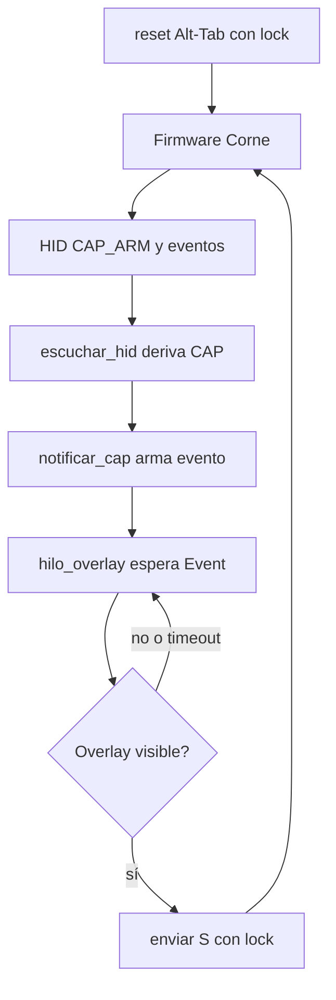

# Especificación: modo captura del Corne

## Estado del documento

**Nace el 2026-09-10**, en la **Task 1**: el código ya existe sin comitear
(`utils/captura/__init__.py` nuevo + 4 puntos en `layer_status_script.py`) y
este contrato deja por escrito qué hace antes de decidir el commit.

## 0. Manifiesto

| id | archivo | rol | estado |
|---|---|---|---|
| C1 | `spec-modo-captura.md` | contrato | vigente · 2026-09-10 |
| E1 | [spec-captura-evento.md](file:///C:/Users/Usuario/qmk_firmware/keyboards/crkbd/keymaps/cornekeymap/tasks/attachments/captura/spec-captura-evento.md) | referencia externa | as-built firmware + validación · 2026-09-09 |
| E2 | [spec-migracion-captura.md](file:///C:/Users/Usuario/qmk_firmware/keyboards/crkbd/keymaps/cornekeymap/tasks/attachments/migra-captura/spec-migracion-captura.md) | referencia externa | plan de migración Task 15 · 2026-09-09 |

## 1. Objetivo

Documentar el modo captura: el teclado avisa por HID, el script vigila el
overlay de Recortes y devuelve `S` una sola vez, sin poll permanente.

## 2. De dónde viene

Esta funcionalidad **nació y se validó en el repo del keymap** (`cornekeymap`):
diseño, pruebas y validación viven allá y aquí solo se referencian — no se
re-detallan para no perder la trazabilidad.

- As-built del firmware y validación (Task 12.1): [spec-captura-evento.md](file:///C:/Users/Usuario/qmk_firmware/keyboards/crkbd/keymaps/cornekeymap/tasks/attachments/captura/spec-captura-evento.md) —
  hold con `Win+Shift+S` + `CAP_ARM`, handler de `S` con espera de 150ms, red
  de 800ms, `V`→`VER_CAPTURE_24262`; medido 100% por `CAP_EVT`, 0 `CAP_NET`,
  ARM→enganche ~365-415ms; commit `83f7e7c464` (2026-09-09). Evidencias
  (watcher, mouse-watch, probe, logs) en [evidence/](file:///C:/Users/Usuario/qmk_firmware/keyboards/crkbd/keymaps/cornekeymap/tasks/attachments/captura/evidence/).
- Plan de migración al script principal (Task 15): [spec-migracion-captura.md](file:///C:/Users/Usuario/qmk_firmware/keyboards/crkbd/keymaps/cornekeymap/tasks/attachments/migra-captura/spec-migracion-captura.md) —
  módulo `utils/captura/` aditivo, hilo dirigido por eventos, `WRITE_LOCK`
  para `dev.write`. Lo que ese plan especificó es lo que aquí se implementó.
- Lo local (Task 1 de este repo): comitear lo migrado (`layer_status_script.py`
  8+/1- + `utils/captura/__init__.py` nuevo, 107 líneas; rama `main` al día
  con `origin/main`) y dejar documentación del lado PC más elaborada
  (§§3-5). El detalle del firmware vive en E1; aquí solo el lado PC.

## 3. Funcionamiento

1. El hold en el Corne manda Win+Shift+S y luego `CAP_ARM` por HID.
2. `escuchar_hid` ve `CAP_*` / `VER_CAPTURE`, llama a `captura.notificar_cap(msg)`
   y hace `continue`: no contamina la lógica de capas ni Alt-Tab (verificado en
   E2 §4: ningún nombre de capa es subcadena de `CAP_*` y ningún `CAP_*`
   contiene `AT_ON`/`AT_OFF`).
3. `notificar_cap` arma el evento (`_armed.set()`, `_deadline = ahora + 0.7s`).
   Solo loguea `CAP_EVT`, `CAP_NET`, `CAP_TGL_*`, `CAP_S_SKIP`, `VER_CAPTURE`.
4. `hilo_overlay` dormía en `_armed.wait()` (cero CPU); al despertar vigila el
   overlay hasta `_deadline` con poll de 0.02s y manda `S` una vez vía
   `dev.write` bajo `WRITE_LOCK`. Si llega otro `CAP_ARM` en el camino
   (`_gen` cambió), no se desarma: se re-vigila. Sin `CAP_ARM` no se mira
   nada: un overlay manual nunca dispara `S` (E2 §3).
5. El hilo alt-tab (`detectar_clic_reset_alt`, comando `R`) escribe al mismo
   handle bajo el mismo `WRITE_LOCK`: `S` y `R` nunca compiten.

## 4. Arquitectura

El candado es el único punto compartido entre los dos escritores HID.

Huella del overlay (`_overlay_visible`): ventana visible, tamaño = pantalla
completa, título `Snipping Tool Overlay`, clase `SnipOverlayRootWindow`.

## 5. Protocolo (firmware 24.390, congelado)

- hold → Win+Shift+S + `CAP_ARM` + arma vigilancia.
- `S` → espera 150ms → engancha + `CAP_EVT`.
- sin `S` → red 800ms + `CAP_NET`.

## 6. En evaluación

- ¿El anexo vive aquí o se espeja en `DOCs/captura.md` como `wrap_around.md`?
- ¿`VENTANA_S = 0.7` se mantiene o se recalibra con medidas nuevas?

## 7. Archivos que toca

- `utils/captura/__init__.py` (nuevo): `VENTANA_S`, `POLL_S`, `WRITE_LOCK`,
  `notificar_cap`, `enviar_s`, `hilo_overlay`, `_overlay_visible`.
- `layer_status_script.py:42`: import del módulo.
- `layer_status_script.py:275-277`: derivación CAP/VER en `escuchar_hid`.
- `layer_status_script.py:309-310`: `R` bajo `WRITE_LOCK`.
- `layer_status_script.py:437`: arranque de `hilo_overlay`.

## 8. Verificación

- El diff de código cubre solo los dos archivos de código (`layer_status_script.py`
  8+/1- + `utils/captura/__init__.py` nuevo) y coincide con los 4 puntos de la
  §7; `git status` además lista los archivos del plan (`AGENTS.md`, `tasks/…`).
- Con overlay presente tras `CAP_ARM`, una sola `S` (verificado con smoke test
  del módulo 2026-09-10; en vivo el log muestra `overlay visto -> S enviada`);
  sin overlay, el hilo vuelve a dormir sin CPU.
- `R` y `S` no se intercalan a nivel de `dev.write` (ambos bajo `WRITE_LOCK`).

## 15. Worklog del agente

- 2026-09-10: contrato creado desde el diff real sin comitear; pendiente
  aprobación de Hero (§6) y contraste contra el código antes del commit.
- 2026-09-10: contraste del ítem 1 — los 4 puntos de la §7 verificados contra
  el diff real (import :42, derivación :275-277, lock :309-310, hilo :437);
  `py_compile` OK y todos los símbolos presentes (`WRITE_LOCK`,
  `notificar_cap`, `enviar_s`, `hilo_overlay`, `_overlay_visible`,
  `CAP_ARM`, huella `Snipping Tool Overlay`/`SnipOverlayRootWindow`).
  Verificación estática del funcionamiento: `_armed.wait()` bloquea (cero CPU
  en reposo), un solo `enviar_s` con `break`, re-vigilancia por `_gen`, ambos
  escritores bajo `WRITE_LOCK`. Falta prueba en vivo con teclado y overlay
  (ítem 3) y aprobación de Hero (ítem 2).
- 2026-09-10: trazabilidad al origen — la funcionalidad nació en `cornekeymap`
  (E1: as-built + validación 100% `CAP_EVT`, commit `83f7e7c464`; E2: plan de
  migración Task 15 con evidencias en `evidence/`). §2 reescrita como
  referencia enlazada en vez de re-detallar; §§3 enriquecidos con dos notas
  citadas (no-colisión E2 §4, overlay manual E2 §3). El firmware se documenta
  solo allá; aquí, lado PC.
- 2026-09-10: Hero aprobó especificación, diagrama y enlaces de origen (ítem 2);
  smoke test funcional del módulo (ítem 3) con `dev` simulado e
  `_overlay_visible` controlada: sin `CAP_ARM` cero escrituras; con overlay una
  sola `S` (`buf[1]=83`); segundo `CAP_ARM` sin overlay sin re-escritura —
  `SMOKE OK`. E2E con teclado real pendiente del uso diario.
- 2026-09-10: contraste final y cierre (ítem 4) — anexo §§3-5/7-8 contra el
  código comiteado; Hero decidió dos commits: código en `52e6c4e`, plan y
  tarea en el commit de esta operación. Block archivado a `completed.md`;
  aprendizaje en `implementations.md` (smoke test HID).
