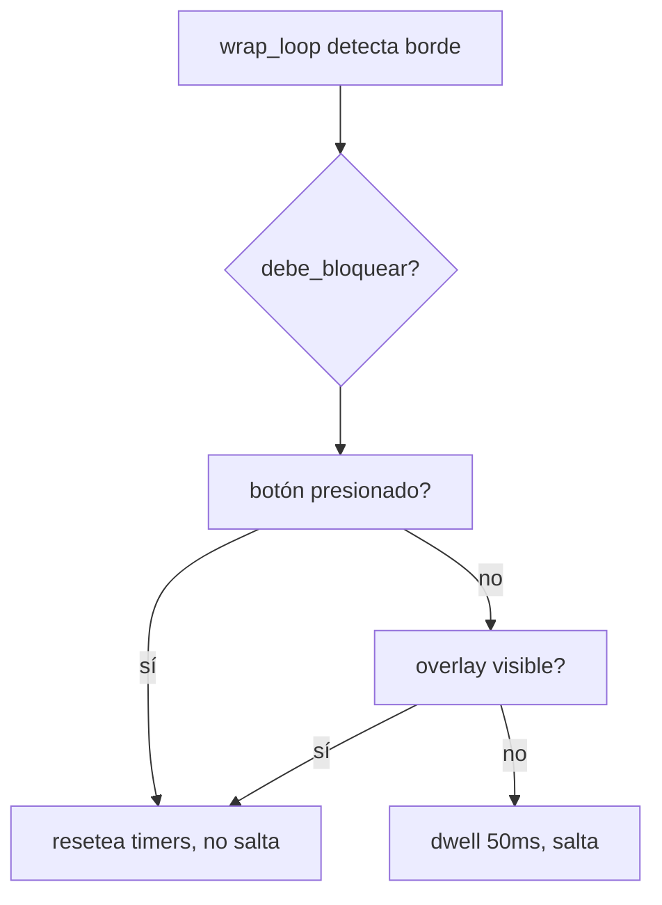

# Especificación: bloquear el wrap al seleccionar o capturar

## Estado del documento

**Nace el 2026-09-10**, en la **Task 17**: el wrap es de uso diario y hoy salta
aunque se esté seleccionando texto o recortando pantalla. Este contrato fija
los casos de bloqueo y el diseño antes de tocar el código.

## 0. Manifiesto

| id | archivo | rol | estado |
|---|---|---|---|
| C1 | `spec-bloqueo-wrap.md` | contrato | vigente · 2026-09-10 · aprobada por Hero 2026-09-10 |

## 1. Objetivo

Que el wrap no salte mientras el puntero está ocupado en otra cosa
(seleccionar, recortar, arrastrar) y siga saltando igual que hoy en
movimiento libre. Mismo wrap, menos sorpresas.

## 2. Revisión del problema

`wrap_loop` (`utils/wrap_around/__init__.py:44-202`) vigila el cursor cada
10ms: si está en el margen del borde y sigue empujando 50ms (`DELAY_MS`),
lo transporta al borde opuesto. No sabe nada del estado de los botones.

Al seleccionar texto se mantiene el botón izquierdo y se empuja más allá de
lo visible: si ese empuje llega al borde de la pantalla 50ms, el salto es
inevitable y la selección se pierde al otro lado. Idéntico mecanismo al
recortar con Recortes: su selección de área es un arrastre con el botón
izquierdo, así que empujar el cuadro hasta el borde dispara el salto.

## 3. Casos de bloqueo

| # | Caso | Señal | Decisión |
|---|---|---|---|
| 1 | Selección de texto (el reporte) | botón izquierdo presionado | ✅ Incluye — predicado base |
| 2 | Recorte de pantalla (el reporte) | overlay visible + arrastre | ✅ Incluye — predicado base |
| 3 | Mover/resize de ventana, arrastrar y soltar, sliders, dibujar | botón izquierdo presionado | ✅ Incluye — sale gratis con el caso 1 |
| 4 | Arrastres con botón derecho (menús, gestos) | botón derecho presionado | ✅ Incluye — misma llamada, costo cero |
| 5 | Captura armada antes del arrastre (`Win+Shift+S`, overlay aún sin drag) | overlay visible (huella `Snipping Tool Overlay`/`SnipOverlayRootWindow`) | ✅ Incluye — reutiliza la huella de `utils/captura` |
| 6 | Menú Alt-Tab visible | bandera `alt_tab_menu_visible` | ❓ En evaluación — el salto ahí es inofensivo pero inútil |
| 7 | App a pantalla completa (juegos, video, RDP) | ventana en foco es fullscreen | ❓ En evaluación — ventana distinta, pide chequeo de foco |
| 8 | Scroll-lock activo (scroll horizontal por movimiento) | bandera del módulo | ❓ En evaluación — mover al borde ahí es scroll, no wrap |

## 4. Diseño

Predicado puro `debe_bloquear()` dentro del módulo wrap, para que sirva igual
en el loop actual que en el hilo único de cursor que propone la Task 16:

1. **Botón:** `GetAsyncKeyState(0x01/0x02)` (izquierdo/derecho) cada iteración —
   barato, sin dependencias nuevas (el módulo ya usa `ctypes`).
2. **Overlay:** huella de `utils/captura` reutilizada vía helper compartido
   (hoy es privada `_overlay_visible` — se expone, no se duplica), evaluada
   como máximo cada ~200ms y solo con el cursor en margen: `EnumWindows` a
   100Hz sería una regresión de rendimiento.
3. Si bloquea: resetea los timers de borde (`borde_x/y = 0`, sin salto) pero
   mantiene el clamp anti-fuga; bandera `BLOQUEAR_EN_ARRASTRE = True` como
   kill-switch para revertir sin git.

## 5. Riesgos (producción, uso diario)

| Riesgo | Mitigación |
|---|---|
| Falso positivo: el wrap deja de funcionar cuando sí se quiere (botón atascado, hold QMK con `MS_BTN1` + teclas al borde) | kill-switch `BLOQUEAR_EN_ARRASTRE`; los holds QMK se evalúan en el contraste diario antes de aprobar |
| Regresión de rendimiento por `EnumWindows` | caché ~200ms + solo en margen; el chequeo de botón es una llamada |
| Falso positivo del overlay (otra ventana fullscreen con misma huella) | la huella es triple (tamaño + clase + título); ya validada en este PC |
| Choque con Task 16 (migración del wrap a eventos) | el predicado es puro y vive en el módulo: lo consume cualquier loop; `Related to: Task 16` |
| Regresión general del wrap calibrado (dwell/cooldown) | no se tocan `DELAY_MS`/`COOLDOWN`/lógica de ejes; cambio solo aditivo + revert por git |

## 6. Validación

- `py_compile` + smoke del predicado (botón simulado, overlay simulado).
- Contraste en uso diario: selección de texto a ambos bordes, recorte a los
  4 bordes, wrap normal a los 4 bordes (sigue igual), arrastre de ventana al
  borde (no salta), drag-and-drop (no salta).

## 7. Archivos que toca

- `utils/wrap_around/__init__.py`: predicado + integración en `wrap_loop`.
- `utils/captura/__init__.py`: exponer la huella del overlay (helper público).
- `layer_status_script.py`: nada previsto (las banderas ya existen si el
  caso 6/8 se aprueba).

## 15. Worklog del agente

- 2026-09-10: contrato creado desde la revisión del código (`wrap_loop`,
  señales disponibles, Task 16 como contexto); pendiente aprobación de Hero,
  incluida la decisión sobre los casos 6-8 en evaluación.
- 2026-09-10: renombre pedido por Hero — `wrap-supresion` → `wrap-bloqueo`
  (bloqueo describe contener el salto, no eliminarlo); actualizados Block,
  título, predicado (`debe_bloquear`), kill-switch (`BLOQUEAR_EN_ARRASTRE`)
  y diagrama. El Block nació hoy y nada lo referencia fuera del plan.
- 2026-09-10: Hero aprobó la especificación y el diagrama (ítem 2; el ítem 1
  se cierra con esta aprobación). Casos 6-8 siguen en evaluación. Siguiente:
  implementar `debe_bloquear()` (ítem 3).
